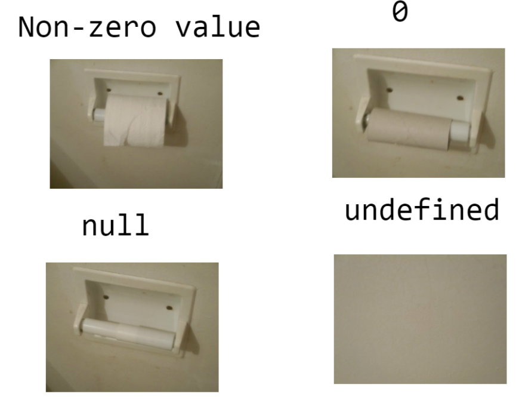
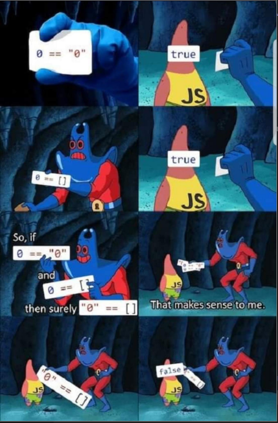

# Webtechnologien

Dieses Repository enthält Links zum Kursthema sowie einen [HTTP-Server](http-server) mit Beispieldaten zum Testen.

## Allgemeine Informationen

- Geschichte des Internets:
  - https://www.fonial.de/wissen/begriff/geschichte-des-internets/
  - https://www.o2business.de/magazin/geschichte-des-internets/
- Selbstvertiefung: Javascript 30 (Wes Bos)
  - Videos (kostenlose Anmeldung erforderlich): https://javascript30.com/ 
  - Vorlagen und Musterlösungen: https://github.com/wesbos/JavaScript30

## Themen

### HTTP

- Eigenschaften:
  - text-basiert
  - zustandslos
  - Request/Response
  - Resource URLs
- Nachrichten
  - Request-Methoden
  - Response Codes
- Weitere Funktionen
  - Content/Language/Encoding Negotiation
  - CORS

### HTML
- Semantisches Markup
- HEAD-Bereich
- Wie funktioniert der Browser? - DOM
- Überschriften
- Block- vs. Inline-Elemente
- Tabellen, Listen, Divs
- Formular (Suchformular, Eingabe von Daten)
- Accessibility
  - WCAG
  - BITV
  - https://www.hellbusch.de/accessibility-checkliste-textalternativen/
  - https://www.barrierefreiheit-dienstekonsolidierung.bund.de/Webs/PB/DE/gesetze-und-richtlinien/barrierefreiheitsstaerkungsgesetz/barrierefreiheitsstaerkungsgesetz-node.html

### CSS
- inline vs. external
- Selektoren: Tag Name, ID, Class
  - https://www.w3schools.com/cssref/css_selectors.php
  - https://www.w3schools.com/cssref/css_ref_combinators.php
  - https://www.w3schools.com/cssref/css_ref_pseudo_classes.php
- Units: 
  - https://www.freecodecamp.org/news/css-units-when-to-use-each-one/
  - https://www.w3.org/Style/Examples/007/units.de.html
- Layouts:
  - Flexbox: https://css-tricks.com/snippets/css/a-guide-to-flexbox/
  - GridLayout: https://css-tricks.com/snippets/css/complete-guide-grid/
- Responsive Design mit Media Queries: https://developer.mozilla.org/en-US/docs/Web/CSS/CSS_media_queries/Using_media_queries

### Javascript

- Entstehung: https://molily.de/js/standards.html
- Skriptsprache
- Datentypen: https://molily.de/js/kernobjekte.html
- Arrow-Functions
- DOM-Manipulation
- Event-Dispatching Thread
- Fallstricke
  - `var`, `let`, `const` (https://www.freecodecamp.org/news/var-let-and-const-whats-the-difference/)
  - `null` vs. `undefined` 
  - ``==` vs. `===` (https://developer.mozilla.org/de/docs/Web/JavaScript/Equality_comparisons_and_sameness) 
  - `'` vs. `"` vs. `` ` ``
- Javascript und HTTP
  - CORS
  - Fetch-Funktion, Promises
- Sonstiges
  - NPM
  - Typescript

## Link-Sammlung

| Technologie | Referenz                                                 | Tutorial                                                              | Weitere Links                                                                                             |
|-------------|----------------------------------------------------------|-----------------------------------------------------------------------|-----------------------------------------------------------------------------------------------------------| 
| NPM         | [Docs](https://docs.npmjs.com/)                          | [First Steps](https://github.com/ueberfuhr-tutorials/npm-first-steps) | [CheatSheet](https://devhints.io/npm)                                                                     |
| HTML        | [W3Schools](https://www.w3schools.com/tags/default.asp)  | [W3Schools](https://www.w3schools.com/Html/)                          | [Entstehungsgeschichte](https://wiki.selfhtml.org/wiki/HTML/Tutorials/Entstehung_und_Entwicklung)         |
| CSS         | [W3Schools](https://www.w3schools.com/cssref/index.php)  | [W3Schools](https://www.w3schools.com/css/default.asp)                |                                                                                                           |
| SCSS        | [Docs](https://sass-lang.com/documentation/syntax/#scss) | [Javatpoint](https://www.javatpoint.com/sass-tutorial)                | [Integration mit NPM](https://www.npmjs.com/package/scss)                                                 |
| Bootstrap   | [Docs](https://getbootstrap.com/docs/)                   | [W3Schools](https://www.w3schools.com/bootstrap5/)                    | [Integration mit NPM](https://getbootstrap.com/docs/5.3/getting-started/download/#npm)                    |
| Javascript  | [W3Schools](https://www.w3schools.com/jsref/default.asp) | [W3Schools](https://www.w3schools.com/js/default.asp)                 | [Versionen](https://www.w3schools.com/js/js_versions.asp), [Linting](https://eslint.org/)                 |
| Typescript  | [Docs](https://www.typescriptlang.org/docs/)             | [Tutorial](https://www.typescripttutorial.net/)                       | [Integration mit NPM](https://www.typescriptlang.org/download/), [Linting](https://typescript-eslint.io/) |
| `curl`      | [Docs](https://curl.se/docs/)                            |                                                                       | [CheatSheet](https://devhints.io/curl)                                                                    |
